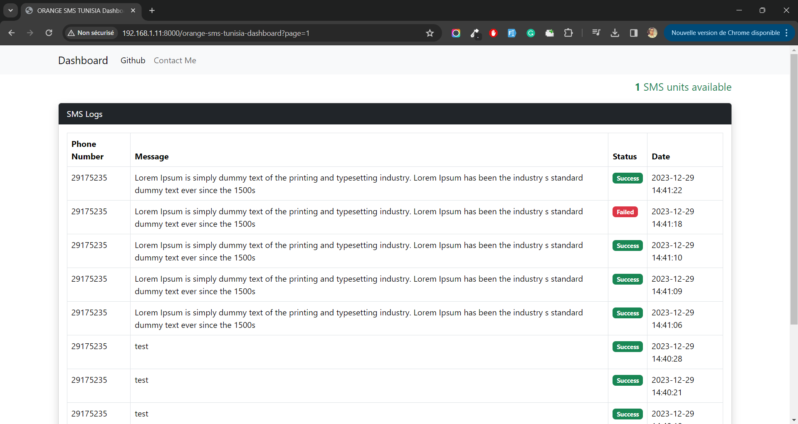

# Laravel Orange SMS Tunisia Package

This Laravel package facilitates the integration of Orange Tunisia SMS services into your Laravel application. With this package, you can easily send SMS messages to phone numbers using the [Orange Tunisia SMS API](https://developer.orange.com/apis/sms-tn/overview).

## Installation

To get started, install the package via composer by running the following command:

```bash
composer require dridihaythem/laravel-orange-sms-tunisia
```

After installation, publish the package configuration files by running the following command:

```bash
php artisan vendor:publish --provider="DridiHaythem\OrangeSMSTunisia\OrangeSMSTunisiaServiceProvider"
```

Next, configure the package in your .env file by providing your Orange Tunisia API token:

```php
ORANGE_SMS_TUNISIA_AUTHORIZATION_HEADER="your_token_here"
```

## Example

-   Send SMS :

    You can use the package to send an SMS by calling the **sendSms** method on the **OrangeSMSTunisiaService** class. Here's a quick example in a Laravel route closure:

    ```php
    use DridiHaythem\OrangeSMSTunisia\Services\OrangeSMSTunisiaService;

    Route::get('/send-sms', function (OrangeSMSTunisiaService $service) {
        $response = $service->sendSms(29175235, "Hello, this is a test message.");

        // Handle the response as needed...

    });
    ```

-   get available units :

    ```php
    use DridiHaythem\OrangeSMSTunisia\Services\OrangeSMSTunisiaService;

    Route::get('/sms-balance', function (OrangeSMSTunisiaService $service) {
        return $service->getAvailableUnits()
    });
    ```

## Dashboard

The package provides a sample dashboard to **display the history of all SMS and available units**. The default route for accessing the dashboard is **/orange-sms-tunisia-dashboard**.



By default, the dashboard is **enabled**. However, you have the flexibility to manually enable or disable the dashboard, or even change the route name, by modifying the configuration file located at **config/orange_sms_tunisia.php** or using .env.

```php
ORANGE_SMS_TUNISIA_DASHBOARD_ENABLE=true
ORANGE_SMS_TUNISIA_DASHBOARD_ROUTE=orange-sms-tunisia-dashboard
```

Feel free to customize the configuration according to your specific requirements.

## Configuration

By default, the package logs all sent SMS messages and their status in a table named **orange_sms_tunisia_logs**. If you wish to disable this logging feature or rename the table name, you can update your .env file:

```php
ORANGE_SMS_TUNISIA_ENABLE_LOG=false
ORANGE_SMS_TUNISIA_LOG_TABLE=orange_sms_tunisia_logs
```

## Contributing

If you encounter any issues or have suggestions for improvements, please feel free to open an issue or submit a pull request. Your contributions are welcome!
